# Fall-2020-Independent-Study
### Tomas Meade
### Professor Ming-Wen An
# Independent Research on COVID-19 and U.S County Characteristics

## Research Focus:
Using data from USAFacts on Coronavirus cases in every county in the U.S and Census Bureau data on the characteristics of those counties in order to create visualizations and potentially identity relationships between characteristics of counties and the spread of Coronavirus. 

## Code Outline:
First economic and demographic data on every county in the United States from the American Community Survey were be uploaded into the Jupyter Notebook as well as mask wearing data and Coronavirus case data on every county. These data were then be merged into a single DataFrame by matching the codes of each county. Using this DataFrame, the relationship between the various characteristics of counties and the cases in counties were examined through visualizations. A function was created to classify each county as very small, small, medium, large and very large based on the county's population. These classifications were then used to create facet plots seperated by county size. A new DataFrame was then created with only counties in the state of Pennsylvania in order to create visualizations on a smaller scale and also incorporate voting data. To do this, a function was created to classify each state as majority democratic or majority republican based on whether the county had more total democratic or republican votes. This was achieved by merging a new dataset with Pennsylvania voting statistics.

## Results
The first visualizations created were centered around poverty rates in each county. A facet plot was created showing poverty rate vs. cumulative cases as of 10/12/2020 seperated by county size. A logarithmic transformation was used for each variable in every visualization.
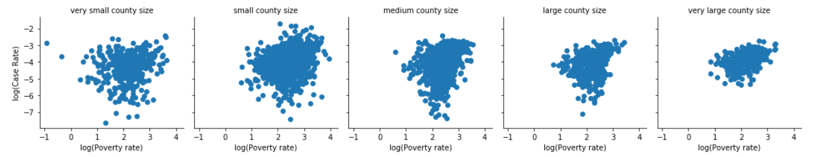

Similar facet plots were created for median household income, percent of population with no health insurance, percent of population using public transportation to work, percent of population that is 85 years or older, percent of population with a bachelor's degree, percent of population who are black or African American, percent of population who are American Indian and Alaska Native, the proportion of people who wear a mask rarely or never and the proportion of people who wear a mask always.

Here are some of the visualizations.

### Median household income
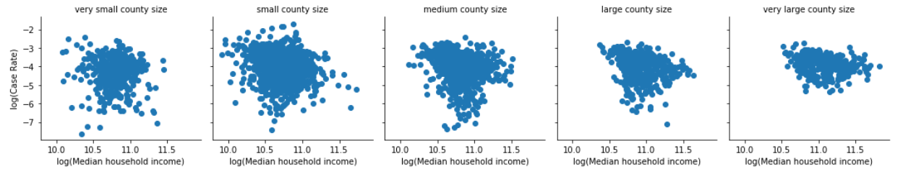

### Percent of population with no health insurance
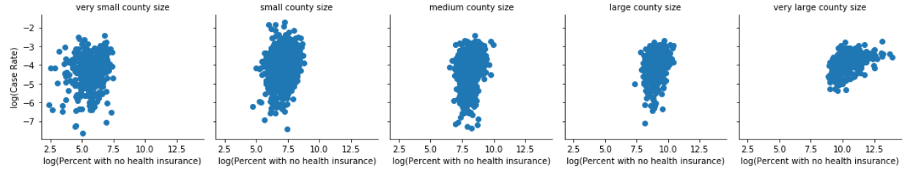

### Percent of population using public transportation to work
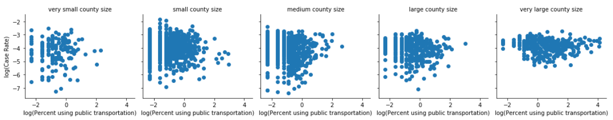

### Percent of population that is 85 years or older
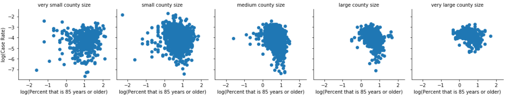

### Percent of population with a bachelor's degree
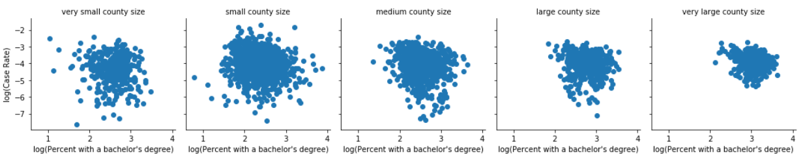

### Percent of population who are black or African American
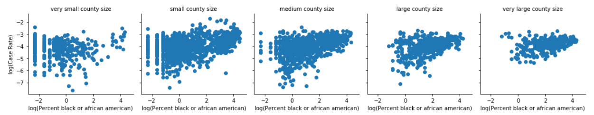

### Percent of population who are American Indian and Alaska Native
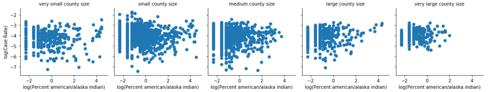

### The proportion of people who wear a mask rarely or never
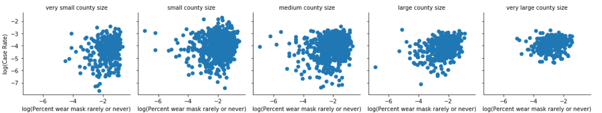

### The proportion of people who wear a mask always
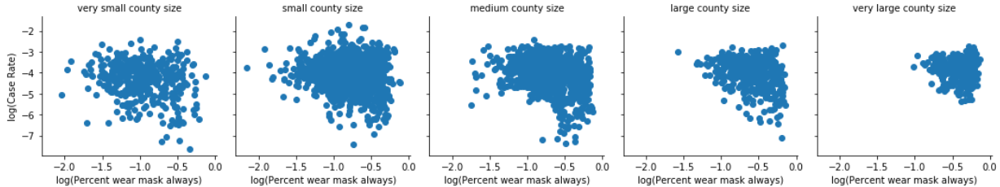

We can see that there is a slight postive association for both poverty rate and the percent of the population that is unisured in relation to case rates for all counties in the U.S. There also seems to be a slight negative association for median household income and slight positve associatons for the percent of the population that is black and the percent of the population that is Native American or Alaska Native. 

## Part 2: Pennsylvania and Party Affilation
The second part of the project focused only on counties in the state of Pennsylvania. Facet plots were again created, but this time counties were seperated based on the dominant party.

Here are some of those visualizations.

### PA: Poverty Rate
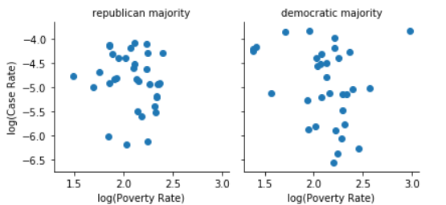

### PA: Median household income
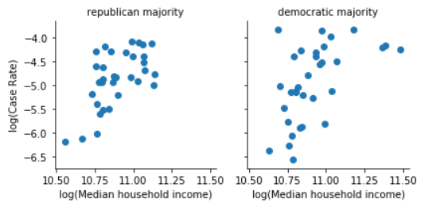

### PA: Percent of population with no health insurance

### PA: Percent of population that is 85 years or older
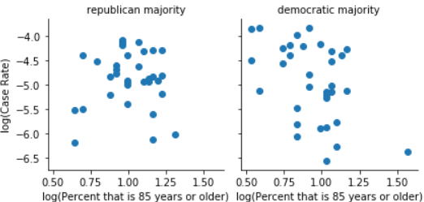

### PA: Percent of population who are black or African American
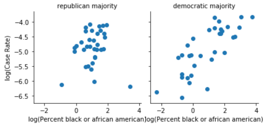

### PA: The proportion of people who wear a mask always
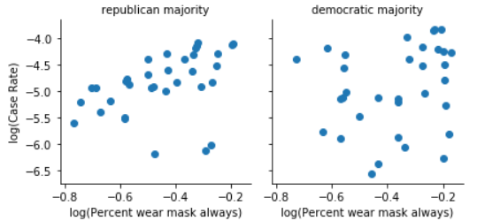

We can see that these scatter plots suggest a slight association between some of these variables and COVID-19 cases. Most notably being the percent of the population that is unisured, which is much more apparent in Pennsylvania alone. There are also positve associations for median household income and the percent of the population that is black or African American. 

There are many different other variables contained in the datasets from the American Community Survey, this project only focuses on a few of them. The final DataFrame that was created in the code contains all variables, which consists of over 1500 different variables in total. This could be beneficial to anyone who wants to conduct research on the COVID-19 as it relates to social, economic and demographic characteristics of counties in the U.S. 

To view the code in more detail and see all visualizations created, see the code file: https://github.com/twarnemiagh/Fall-2020-Independent-Study/blob/main/Independent%20Study.ipynb

To see screenshots of all visualizations, see the visualizations folder: https://github.com/twarnemiagh/Fall-2020-Independent-Study/tree/main/Visualizations

To see the codebook for this project with descriptions of the variables, datasets and sources, see the codebook file: https://github.com/twarnemiagh/Fall-2020-Independent-Study/blob/main/Codebook.md

To find all the datasets used, see the dataset file: https://github.com/twarnemiagh/Fall-2020-Independent-Study/tree/main/Datasets 
